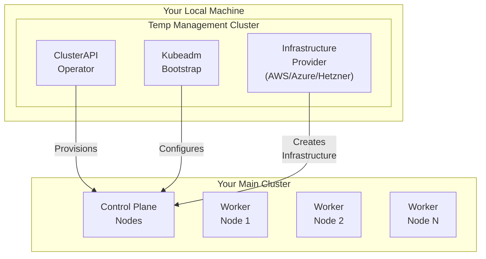

# Installation

This guide covers bootstrapping your KubeAid-managed Kubernetes cluster.
The installation process is **the same for all providers**
and the configuration files you prepared in the previous step contain all provider-specific details.

## Before You Begin

Ensure you have completed:

- [x] [Prerequisites](./prerequisites.md) - All required tools installed
- [x] [Pre-Configuration](./pre-configuration.md) - `general.yaml` and `secrets.yaml` configured or,

Make sure :

- Docker is running locally
- Your configuration files are in `outputs/configs/`
- Your `secrets.yaml` is backed up in your password store

## Installing KubeAid CLI

If you haven't already installed the KubeAid CLI, run:

```bash
KUBEAID_CLI_VERSION=$(curl -s "https://api.github.com/repos/Obmondo/kubeaid-cli/releases/latest" | jq -r .tag_name)
OS=$([ "$(uname -s)" = "Linux" ] && echo "Linux" || echo "Darwin")
CPU_ARCHITECTURE=$([ "$(uname -m)" = "x86_64" ] && echo "amd64" || echo "arm64")

wget "https://github.com/Obmondo/kubeaid-cli/releases/download/${KUBEAID_CLI_VERSION}/kubeaid-cli_${OS}_${CPU_ARCHITECTURE}.tar.gz"
tar -xzf kubeaid-cli_${OS}_${CPU_ARCHITECTURE}.tar.gz
sudo mv kubeaid-cli /usr/local/bin/kubeaid-cli
sudo chmod +x /usr/local/bin/kubeaid-cli
rm kubeaid-cli_${OS}_${CPU_ARCHITECTURE}.tar.gz
```

> **Note:** This script works on both Linux and macOS. For Linux users who prefer native package managers,
> see the [Native Package Installation](#native-package-installation) section below.

Verify the installation:

```bash
kubeaid-cli --version
```

### Manual Installation (tar.gz Packages)

You can also manually download the appropriate tar.gz package for your platform from the [releases page](https://github.com/Obmondo/kubeaid-cli/releases).

#### Available tar.gz Packages

| Platform | Architecture | Package Name |
| ---------- | -------------- | -------------- |
| macOS | ARM64 (Apple Silicon) | `kubeaid-cli_Darwin_arm64.tar.gz` |
| macOS | x86_64 (Intel) | `kubeaid-cli_Darwin_x86_64.tar.gz` |
| Linux | ARM64 | `kubeaid-cli_Linux_arm64.tar.gz` |
| Linux | x86_64 | `kubeaid-cli_Linux_x86_64.tar.gz` |

#### Installation Steps

1. **Download the appropriate package** for your platform:

   ```bash
   # Example for Linux x86_64
   wget https://github.com/Obmondo/kubeaid-cli/releases/latest/download/kubeaid-cli_Linux_x86_64.tar.gz
   ```

2. **Extract the archive**:

   ```bash
   tar -xzf kubeaid-cli_<OS>_<ARCH>.tar.gz
   ```

3. **Move the binary to your PATH**:

   ```bash
   sudo mv kubeaid-cli /usr/local/bin/
   sudo chmod +x /usr/local/bin/kubeaid-cli
   ```

4. **Verify the installation**:

   ```bash
   kubeaid-cli --version
   ```

### Native Package Installation

Native packages are available for Linux distributions in both `amd64` and `arm64` architectures:

| Format | Architecture | Package Name | Distribution |
| -------- | -------------- | -------------- | -------------- |
| `.deb` | amd64 | `kubeaid-cli_v<VERSION>_linux_amd64.deb` | Debian, Ubuntu |
| `.deb` | arm64 | `kubeaid-cli_v<VERSION>_linux_arm64.deb` | Debian, Ubuntu |
| `.rpm` | amd64 | `kubeaid-cli_v<VERSION>_linux_amd64.rpm` | RHEL, Fedora, CentOS |
| `.rpm` | arm64 | `kubeaid-cli_v<VERSION>_linux_arm64.rpm` | RHEL, Fedora, CentOS |
| `.apk` | amd64 | `kubeaid-cli_v<VERSION>_linux_amd64.apk` | Alpine Linux |
| `.apk` | arm64 | `kubeaid-cli_v<VERSION>_linux_arm64.apk` | Alpine Linux |
| `.pkg.tar.zst` | amd64 | `kubeaid-cli_v<VERSION>_linux_amd64.pkg.tar.zst` | Arch Linux |
| `.pkg.tar.zst` | arm64 | `kubeaid-cli_v<VERSION>_linux_arm64.pkg.tar.zst` | Arch Linux |

> **Note:** Replace `<VERSION>` with the actual version number (e.g., `v0.17.1`).

#### Installation Examples

**Debian/Ubuntu:**

```bash
KUBEAID_CLI_VERSION=$(curl -s "https://api.github.com/repos/Obmondo/kubeaid-cli/releases/latest" | jq -r .tag_name)
CPU_ARCHITECTURE=$([ "$(uname -m)" = "x86_64" ] && echo "amd64" || echo "arm64")
wget "https://github.com/Obmondo/kubeaid-cli/releases/download/${KUBEAID_CLI_VERSION}/kubeaid-cli_${KUBEAID_CLI_VERSION}_linux_${CPU_ARCHITECTURE}.deb"
sudo dpkg -i kubeaid-cli_${KUBEAID_CLI_VERSION}_linux_${CPU_ARCHITECTURE}.deb
```

**RHEL/Fedora/CentOS:**

```bash
KUBEAID_CLI_VERSION=$(curl -s "https://api.github.com/repos/Obmondo/kubeaid-cli/releases/latest" | jq -r .tag_name)
CPU_ARCHITECTURE=$([ "$(uname -m)" = "x86_64" ] && echo "amd64" || echo "arm64")
wget "https://github.com/Obmondo/kubeaid-cli/releases/download/${KUBEAID_CLI_VERSION}/kubeaid-cli_${KUBEAID_CLI_VERSION}_linux_${CPU_ARCHITECTURE}.rpm"
sudo rpm -i kubeaid-cli_${KUBEAID_CLI_VERSION}_linux_${CPU_ARCHITECTURE}.rpm
```

### Verifying Checksums

Each release includes a checksums file (`kubeaid-cli_<VERSION>_checksums.txt`) for verifying download integrity:

```bash
KUBEAID_CLI_VERSION=$(curl -s "https://api.github.com/repos/Obmondo/kubeaid-cli/releases/latest" | jq -r .tag_name)
wget "https://github.com/Obmondo/kubeaid-cli/releases/download/${KUBEAID_CLI_VERSION}/kubeaid-cli_${KUBEAID_CLI_VERSION#v}_checksums.txt"
sha256sum -c kubeaid-cli_${KUBEAID_CLI_VERSION#v}_checksums.txt --ignore-missing
```

## Bootstrap the Cluster

Run the bootstrap command:

```bash
kubeaid-cli cluster bootstrap
```

### What Happens During Bootstrap

The bootstrap process will:

1. **Create a local management cluster** - A temporary K3D cluster for orchestration
2. **Provision infrastructure** - Create cloud resources (for cloud providers) or configure SSH access (for bare metal)
3. **Initialize Kubernetes** - Deploy the control plane and worker nodes
4. **Install core components** - Deploy Cilium, ArgoCD, Sealed Secrets, and KubePrometheus
5. **Configure GitOps** - Set up ArgoCD to sync with your kubeaid-config repository

#### Bootstrap Architecture (ClusterAPI)



> **Note:** For KubeOne (SSH-only bare metal), there is no management cluster. KubeOne connects directly
> to your servers via SSH.

### Monitoring Progress

- Logs are streamed to your terminal in real-time
- All logs are saved to `outputs/.log` for later review
- The process typically takes 10-30 minutes (depending on provider and cluster size)

### Bootstrap Output

Upon successful completion, you'll see:

```text
✓ Cluster bootstrap complete!
  Kubeconfig saved to: outputs/kubeconfigs/clusters/main.yaml
```

## Access the Cluster

Set your kubeconfig and verify access:

```bash
export KUBECONFIG=./outputs/kubeconfigs/main.yaml
kubectl cluster-info
```

Expected output:

```text
Kubernetes control plane is running at https://<cluster-endpoint>:6443
CoreDNS is running at https://<cluster-endpoint>:6443/api/v1/namespaces/kube-system/services/kube-dns:dns/proxy
```

### Verify Nodes

```bash
kubectl get nodes
```

All nodes should show `Ready` status.

### Verify Core Components

```bash
# Check all pods are running
kubectl get pods -A

# Check ArgoCD applications
kubectl get applications -n argocd
```

## Troubleshooting

### Common Issues

| Issue | Cause | Solution |
| ------- | ------- | ---------- |
| Bootstrap hangs | Network issues or resource constraints | Check logs in `outputs/.log` |
| Management cluster fails to create | Docker not running | Start Docker and retry |
| Cloud resources fail to provision | Invalid credentials | Verify `secrets.yaml` credentials |
| SSH connection fails (bare metal) | SSH key issues | Verify SSH key permissions and host connectivity |
| Nodes not joining | Network or firewall issues | Check security groups/firewall rules |

### Viewing Logs

```bash
# View bootstrap logs
cat outputs/.log

# Follow logs in real-time (if bootstrap is running)
tail -f outputs/.log
```

### Retry Bootstrap

If bootstrap fails partway through, you can retry:

```bash
# Clean up partial state
kubeaid-cli cluster delete management

# Retry bootstrap
kubeaid-cli cluster bootstrap
```

## Provider-Specific Notes

### AWS

The bootstrap creates:

- VPC with public/private subnets
- NAT Gateway for private subnet egress
- Security groups for control plane and workers
- EC2 instances for nodes
- Elastic Load Balancer for API server

### Azure

The bootstrap creates:

- Resource group for all resources
- Virtual network with subnets
- Network security groups
- Virtual machines for nodes
- Azure Load Balancer for API server

### Hetzner

#### HCloud

- Creates cloud servers for control plane and workers
- Sets up private network for inter-node communication
- Configures load balancer for API server

#### Bare Metal

- Connects to existing servers via SSH
- Configures networking and disk layout
- Does not create new infrastructure

### Bare Metal (SSH-only)

- Connects to your servers via SSH
- Installs Kubernetes components directly
- No cloud resources created
- You manage the server lifecycle

### Local K3D

- Creates a K3D cluster in Docker
- For testing only-not for production
- No cluster upgrades or disaster recovery support

## Next Steps

Once your cluster is up and running:

1. **[Post-Configuration](./post-configuration.md)** - Access dashboards, verify setup, configure services
